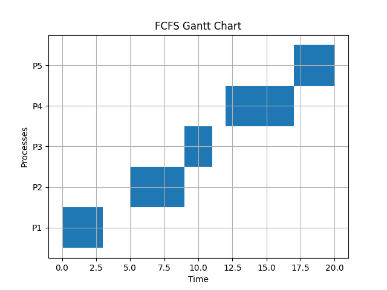

# OS 排程演算法專案文件

本文檔旨在說明在 `Nttu_OS_Project` 中實現的三種 CPU 排程演算法：FCFS、Round Robin 和 MLFQ。每種演算法都有對應的 Python 腳本，並生成了視覺化的甘特圖和效能分析結果。

## 1. 先來先服務 (First-Come, First-Served, FCFS)

### 1.1. 演算法原理

FCFS 是最簡單的排程演算法。其原則是**先進先出**：哪個行程最先到達就緒佇列，就最先獲得 CPU 資源。此演算法為非搶佔式 (Non-preemptive)，一旦行程開始執行，就會一直執行到完成或因 I/O 等待而阻塞。

### 1.2. 程式碼實作 (`FCFS.py`)

- **`Process` 類別**: 用於儲存行程的屬性，如 PID、到達時間、執行時間、完成時間等。
- **`fcfs_scheduling` 函數**:
    1. 根據行程的 `arrival_time` 進行排序。
    2. 遍歷排序後的行程列表，模擬 CPU 執行。
    3. 計算每個行程的完成時間、周轉時間 (Turnaround Time) 和等待時間 (Waiting Time)。
    4. 計算所有行程的平均值。
- **`plot_gantt_chart` 函數**: 使用 `matplotlib` 繪製甘特圖，視覺化展示 CPU 的分配情況。

### 1.3. 執行結果

我們使用 5 個模擬行程來測試 FCFS 演算法：

| PID | 到達時間 (Arrival) | 執行時間 (Burst) |
|:---:|:------------------:|:----------------:|
| 1   | 0                  | 3                |
| 2   | 5                  | 4                |
| 3   | 6                  | 2                |
| 4   | 12                 | 5                |
| 5   | 15                 | 3                |

**效能指標:**
- **平均等待時間**: 3.20
- **平均周轉時間**: 6.80
- **平均回應時間**: 2.60

**甘特圖:**



---

## 2. 時間輪轉 (Round Robin, RR)

### 2.1. 演算法原理

Round Robin 是一種搶佔式 (Preemptive) 排程演算法，專為分時系統設計。它為每個行程分配一個固定的時間片 (Time Quantum, TQ)。行程在 CPU 上執行，直到：
1. 行程執行完畢。
2. 時間片用完。

如果時間片用完但行程尚未完成，該行程會被放回就緒佇列的末尾，等待下一次輪轉。RR 的效能極度依賴於時間片的長度。

### 2.2. 程式碼實作 (`Round Robin.py`)

- **`round_robin_scheduling` 函數**:
    1. 使用 `collections.deque` 作為就緒佇列。
    2. 模擬時鐘推進，並在每個時間點檢查是否有新行程到達。
    3. 當行程執行時，會根據 `time_quantum` 和其剩餘執行時間來決定實際執行多久。
    4. 如果時間片用完，行程會被移回佇列尾部。
    5. 記錄每個行程的效能指標和甘特圖資訊。
- **`plot_gantt_chart` 函數**: 繪製甘特圖。
- **`plot_comparison_chart` 函數**: 比較不同時間片長度下的平均等待時間和周轉時間。

### 2.3. 執行結果

我們使用相同的行程資料，但測試了多個不同的時間片長度 (TQ = 2, 4, 6, 8)。

**甘特圖範例 (TQ=2 vs TQ=4):**

| TQ=2                                        | TQ=4                                        |
|---------------------------------------------|---------------------------------------------|
|  |  |

**效能比較:**


從比較圖中可以看出，時間片的選擇會顯著影響系統效能。在本例中，較大的時間片 (接近 FCFS) 帶來了較低的平均等待和周轉時間，但這也可能犧牲即時回應性。

---

## 3. 多層回饋佇列 (Multi-level Feedback Queue, MLFQ)

### 3.1. 演算法原理

MLFQ 是一種複雜的排程演算法，它試圖同時滿足不同類型行程的需求（如 I/O 密集型和 CPU 密集型），目標是：
- **低周轉時間**: 盡快完成短任務。
- **低回應時間**: 優先處理互動式任務。

MLFQ 包含多個佇列，每個佇列有不同的優先權。其運作基於一組規則：
1.  **規則 1**: 如果 A 的優先權 > B 的優先權，則執行 A。
2.  **規則 2**: 如果 A 的優先權 = B 的優先權，則使用 RR 輪流執行。
3.  **規則 3**: 新行程進入系統時，放在最高優先權的佇列。
4.  **規則 4**: 一旦行程用完其在某個佇列的時間片，它將被**降級**到較低的佇列。
5.  **規則 5 (老化, Aging)**: 為了防止飢餓 (Starvation)，在等待過久的行程會被**提升**到較高的優先權佇列。

### 3.2. 程式碼實作 (`MLFQ.py`)

- **`mlfq_scheduling_with_history` 函數**:
    1. 設置 3 個佇列 (`queues`)，分別對應不同的優先權。Q0 和 Q1 使用 RR，Q2 使用 FCFS。
    2. 模擬時鐘，並根據上述 MLFQ 規則處理行程的移動：
        - 新行程加入 Q0。
        - 根據時間片 (`quantums`) 決定是否降級。
        - 優先執行高優先權佇列中的行程 (搶佔)。
        - 定期觸發老化 (`aging_period`)，將所有行程移回 Q0。
    3. 記錄詳細的執行歷史 (`gantt_history`) 以便繪圖。
- **`plot_gantt_chart` 函數**: 根據執行歷史繪製甘特圖。

### 3.3. 執行結果

我們設定了 3 個佇列，時間片分別為 Q0 (TQ=2) 和 Q1 (TQ=4)，老化週期為 20。

**效能指標:**
- **平均周轉時間**: 8.40
- **平均等待時間**: 4.80
- **平均回應時間**: 1.20

**甘特圖:**


從甘特圖中可以看到行程在不同佇列間的移動，以及高優先權行程搶佔低優先權行程的行為。MLFQ 成功地提供了非常低的平均回應時間。

---

## 4. 總結與比較

下表彙總了三種演算法在相同行程負載下的效能表現：

| 演算法         | 平均等待時間 (WT) | 平均周轉時間 (TAT) | 平均回應時間 (RT) |
|----------------|:-----------------:|:------------------:|:-----------------:|
| **FCFS**       | 3.20              | 6.80               | 2.60              |
| **RR (TQ=4)**  | 4.60              | 8.20               | 2.00              |
| **MLFQ**       | 4.80              | 8.40               | **1.20**          |

- **FCFS** 在這個特定案例中表現出不錯的平均等待和周轉時間，但這是因為行程到達時間比較分散。如果短行程在長行程後到達，FCFS 的效能會很差。
- **Round Robin** 提供了較好的回應時間，但上下文切換的開銷導致其平均等待和周轉時間高於 FCFS。
- **MLFQ** 實現了**最低的平均回應時間**，證明其在處理互動式任務方面的優勢。雖然其平均等待和周轉時間最高，但它提供了一種更平衡、更靈活的排程策略。

## 5. 如何執行

確保已安裝 `matplotlib` 和 `pandas`。如果沒有，請執行：
```bash
pip install -r requirements.txt
```

然後，您可以單獨執行每個腳本來重現結果：
```bash
python FCFS.py
python "Round Robin.py"
python MLFQ.py
```

